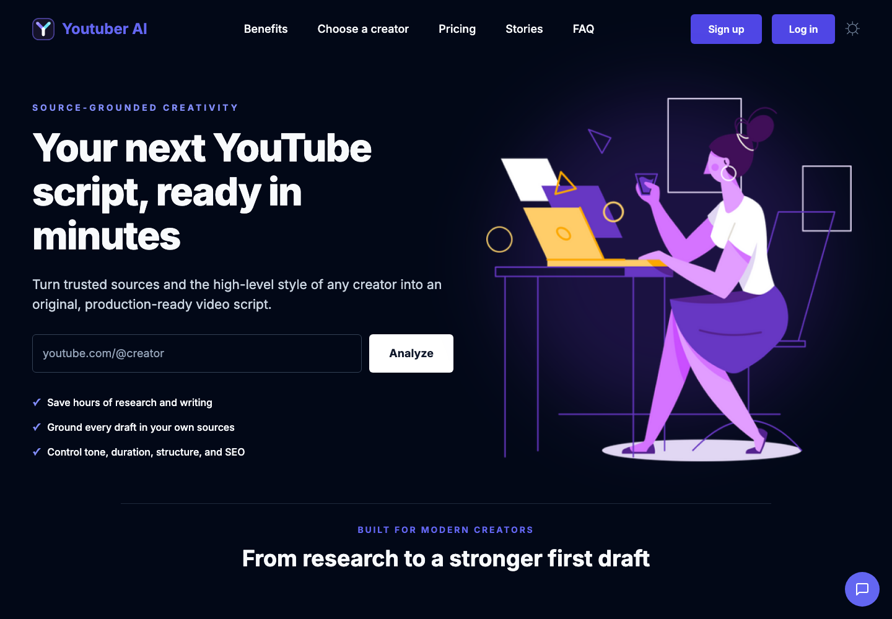
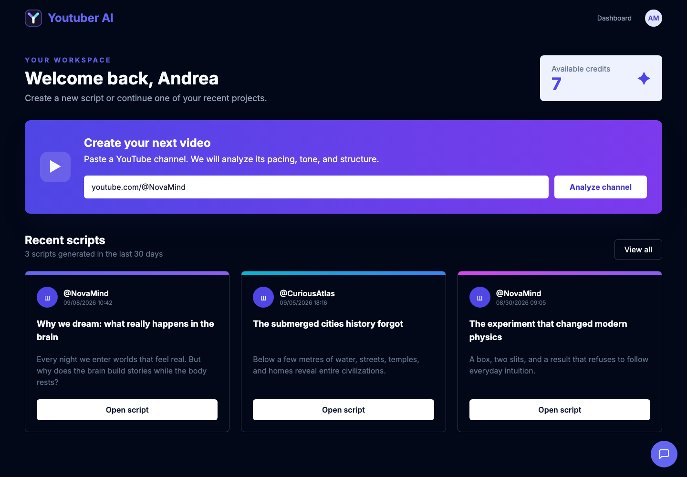
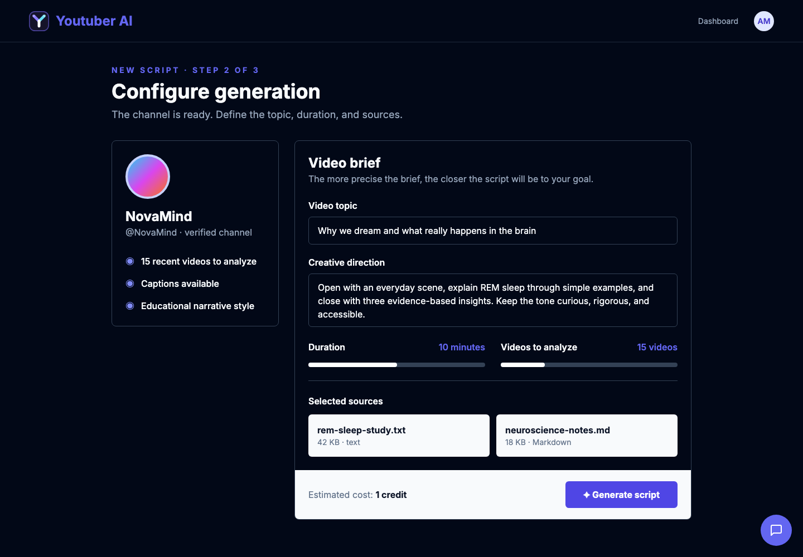
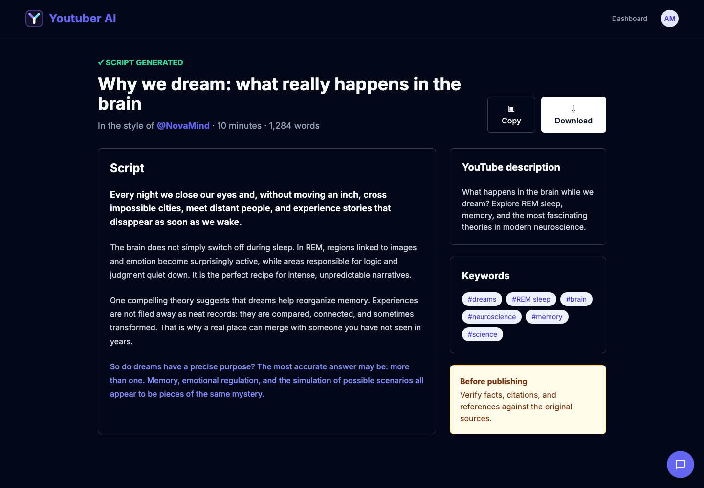
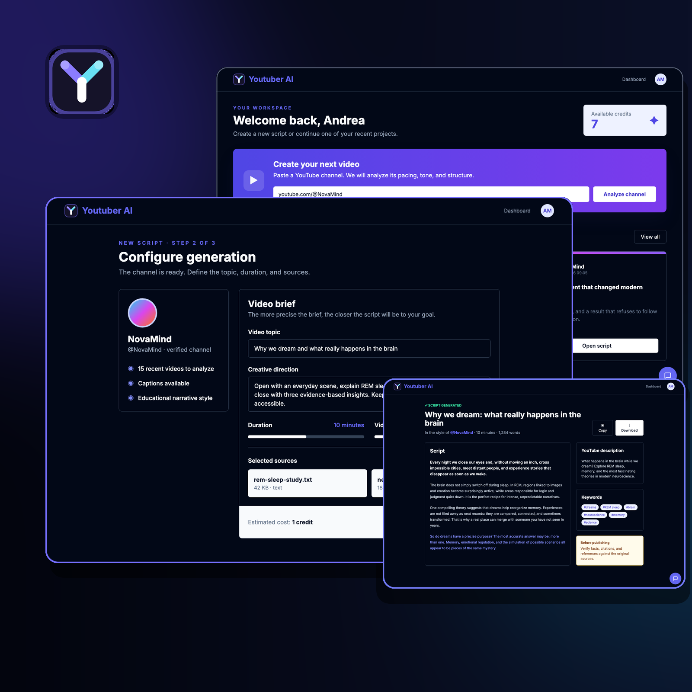

<p align="center">
  
</p>

# Youtuber AI — source-grounded scripts inspired by YouTube creators

Youtuber AI is a Next.js prototype for creating video scripts from a topic, user-provided sources, and the observable style of a selected YouTube channel. The application combines an Italian marketing site, Firebase email/password authentication, YouTube channel discovery, caption extraction, a credit-oriented dashboard, and reusable UI primitives.



> **Status: functional prototype.** The landing page, authentication shell, channel lookup, transcript collection, Vertex AI script generation, iterative revisions, copy/download actions, dashboard read model, and production build exist. Persistence, credit charging, checkout, and production hardening remain incomplete.

## Reading guide

| Document | Scope |
|---|---|
| [Architecture](docs/ARCHITECTURE.md) | Runtime boundaries, rendering model, data flow, dependencies, and extension rules |
| [Product workflows](docs/WORKFLOWS.md) | Landing, authentication, channel analysis, generation form, dashboard, and contact widget |
| [Data model](docs/DATA_MODEL.md) | Current Firestore paths, inferred script shape, ownership, and recommended evolution |
| [Server actions](docs/SERVER_ACTIONS.md) | YouTube Data API calls, caption scraping, inputs, outputs, and failure behaviour |
| [Security and privacy](docs/SECURITY_AND_PRIVACY.md) | Trust boundaries, credentials, external processing, data exposure, and hardening priorities |
| [Setup and operations](docs/SETUP_AND_OPERATIONS.md) | Firebase/YouTube setup, environment variables, local commands, deployment, and observability |
| [Testing and releases](docs/TESTING_AND_RELEASES.md) | Current quality baseline, missing test layers, and release checklist |
| [Troubleshooting](docs/TROUBLESHOOTING.md) | Symptom-driven diagnosis for authentication, YouTube, Firestore, builds, and UI flows |
| [Contributing](CONTRIBUTING.md) | Change workflow, conventions, review expectations, and definition of done |

## What the product is intended to do

The intended user journey is:

1. enter a YouTube channel URL, handle, or channel ID;
2. resolve the channel and show its name and avatar;
3. choose a theme, describe the desired script, select a target duration, and choose how many recent videos to analyse;
4. upload text sources that should ground the new content;
5. retrieve recent video IDs and captions from the selected channel;
6. generate a new title, script, description, and keyword set;
7. charge one or more credits and persist the result;
8. review, copy, or download previous scripts from the dashboard.

The current repository implements steps 1–6 and the review/copy/download portion of step 8. Generated scripts are not yet persisted, and credits or purchases are not enforced.

## Current product surfaces

### Public landing page

The root route renders a marketing experience in Italian with:

- a channel input in the hero;
- product benefits and suitable creator categories;
- testimonials and FAQ content;
- four hard-coded credit offers;
- light/dark theme support;
- a floating Web3Forms contact widget.

The root Server Component inspects the signed Firebase application cookie. Logged-in visitors see a dashboard call to action; anonymous visitors see signup/login actions and are prompted to authenticate before submitting a channel.

### Authentication

Signup and login use Firebase Authentication in the browser. After Firebase returns an ID token, the application calls the virtual `/api/login` endpoint handled by `next-firebase-auth-edge`; the middleware exchanges the bearer token for a signed, HTTP-only application cookie.

Signup also creates `users/{uid}` in Firestore with a username and one initial credit. Logout signs out the browser Firebase client and calls `/api/logout` to clear the application cookie.

### Channel lookup and transcript collection

The main form accepts:

- `youtube.com/@handle`;
- `youtube.com/channel/<channel-id>`;
- a direct alphanumeric, underscore, or hyphen identifier.

Handles are resolved through YouTube Data API v3 search. Channel metadata comes from the channels endpoint. The generation dialog then asks the server to list recent videos and retrieve captions directly from each YouTube watch page.

Only videos at least 150 seconds long are retained. Caption tracks are prioritised by English language first and human-created tracks before automatic speech recognition when otherwise comparable.

### Generation request form

The dialog currently validates:

| Field | Current constraint |
|---|---|
| Theme | 2–50 characters |
| Description | 20–600 characters |
| Duration | 2–20 minutes; UI default 10 |
| Videos to analyse | 5–50; UI default 15 |
| Sources | schema allows 1–4 files |

The dropzone accepts up to four text, Markdown, or CSV files of 1 MB each. The browser reads them as text, then sends their contents with the brief to an authenticated Server Action. The server independently validates the command, retrieves channel transcripts, bounds the combined context, and calls Vertex AI for a structured title, script, description, and keyword set.

### Dashboard

`/dashboard` is protected by middleware and derives the user ID from the signed application cookie. It renders:

- the username;
- current credit count;
- the same channel form used on the landing page;
- static credit purchase cards;
- script preview cards read from a top-level Firestore collection whose name equals the Firebase UID.

No active source path currently writes generated scripts. Purchase buttons do not initiate checkout, and credits are not debited by generation or granted after signup.

## Product tour

The following product views use fictional creator names, scripts, account data, files, and credit balances. They are deterministic English-language showcases of the current interface and core workflow, designed to document the product without exposing real user information.

### Creator workspace

The dashboard brings the next action, available credits, and recent projects into one view. The synthetic example shows how a returning creator could start from a channel and reopen previous scripts.



### Generation brief

After resolving a channel, the request flow combines creator context, theme, creative instructions, duration, analysis depth, and source files. The displayed creator and files are fictional.



### Generated script review

The result view keeps the long-form script beside its YouTube description, keyword set, revision form, and working copy/download actions.



### Social preview

The square composition below condenses the main workflow into a single shareable image: creator workspace, generation brief, and generated script.



Regenerate it from the three product screenshots and the current SVG logo with ImageMagick:

```bash
tools/compose-linkedin-image.sh
```

## Architecture

```text
Browser
  ├── React Client Components
  │    ├── Firebase Auth SDK
  │    ├── Firestore signup write
  │    ├── forms, dialogs, theme, dropzone
  │    └── Web3Forms contact request
  │
  └── HTTP request / signed auth cookie
       │
       ▼
Next.js 14 App Router
  ├── Server Components: / and /dashboard
  ├── Server Actions: validation, YouTube retrieval, generation, revision
  ├── Server-only Vertex AI adapter
  └── Edge middleware: login/logout and dashboard protection
       │
       ├── YouTube Data API v3
       ├── YouTube watch pages and caption endpoints
       ├── Google Vertex AI
       └── Firebase Auth / Firestore
```

Three identity mechanisms must be kept distinct:

1. the Firebase browser session, used by the client SDK;
2. the Firebase ID token, sent once to `/api/login`;
3. the signed application cookie, verified by Next.js middleware and Server Components.

See [Architecture](docs/ARCHITECTURE.md) for exact boundaries and known coupling.

## Technology stack

| Layer | Current implementation |
|---|---|
| Application | Next.js 14.2.4, App Router, React 18 |
| Styling | Tailwind CSS 3, CSS variables, `next-themes` |
| UI | local shadcn-style components, Radix UI, Headless UI, Lucide, Heroicons |
| Forms | React Hook Form, Zod, hookform resolvers |
| Identity | Firebase Authentication, `next-firebase-auth-edge` |
| Persistence | Cloud Firestore through the Firebase Web SDK |
| External content | YouTube Data API v3 and YouTube caption endpoints |
| Generation | Google Vertex AI with schema-constrained JSON output |
| File selection | react-dropzone with browser-side text extraction |
| Image pipeline | Next.js Image and Sharp |

Exact dependency constraints live in `package.json`; exact installed resolutions live in `package-lock.json`.

## Repository layout

```text
YoutuberAI/
├── auth-config.js                # shared Firebase client/server auth configuration
├── src/
│   ├── app/
│   │   ├── page.js               # cookie-aware public entry point
│   │   ├── homepage.jsx          # landing composition
│   │   ├── actions.js            # authenticated generation orchestration and YouTube adapters
│   │   ├── login/                # email/password login
│   │   ├── signup/               # account creation and initial Firestore profile
│   │   ├── dashboard/            # protected account and script history view
│   │   ├── createScriptDialog.js # generation request form and source picker
│   │   └── scriptDialog.js       # persisted-script preview/detail UI
│   ├── components/
│   │   ├── firebase.js           # Firebase browser SDK composition root
│   │   ├── form.js               # reusable channel entry flow
│   │   ├── sections/             # landing, navigation, pricing, FAQ, contact UI
│   │   └── ui/                   # reusable Radix/shadcn-style primitives
│   ├── lib/
│   │   ├── utils.js              # class-name composition helper
│   │   └── vertex-ai.js          # server-only model client and output validation
│   └── middleware.js             # auth endpoints and /dashboard gate
├── public/img/                   # logo, illustrations, testimonials, brand assets
├── docs/                         # engineering documentation
└── package.json                  # commands and dependency manifest
```

## Getting started

### Prerequisites

- Node.js 20 LTS is recommended. `next-firebase-auth-edge@1.5.3` declares Node `>=16 <22` and npm `>=8 <11`; Node 22/24 or npm 11 produces an engine warning.
- npm and a Firebase project with Email/Password Authentication and Firestore enabled.
- a Google Cloud project with YouTube Data API v3 and Vertex AI enabled.

### Install and run

```bash
npm install
cp .env.example .env
npm run dev
```

Open [http://localhost:3000](http://localhost:3000).

Populate `.env` with your own development credentials. The repository currently contains a tracked `.env`; treat any real values that have ever been committed as exposed, rotate them, and remove the file from version control before sharing or deploying the repository.

### Common commands

| Command | Purpose | Current state |
|---|---|---|
| `npm run dev` | Start the development server | Available |
| `npm run build` | Create an optimised production build | Verified on 2026-09-09 |
| `npm run start` | Serve a completed production build | Available after build |
| `npm run lint` | Run Next.js linting | Opens first-run ESLint setup; not CI-ready |

There are no test, typecheck, format, emulator, or end-to-end scripts yet.

## Configuration summary

| Variable | Exposure | Purpose |
|---|---|---|
| `YOUTUBE_API_KEY` | Server only | YouTube Data API v3 requests |
| `NEXT_PUBLIC_FIREBASE_PROJECT_ID` | Public | Firebase project identifier |
| `NEXT_PUBLIC_FIREBASE_API_KEY` | Public | Firebase client API key |
| `NEXT_PUBLIC_FIREBASE_AUTH_DOMAIN` | Public | Firebase Auth domain |
| `NEXT_PUBLIC_FIREBASE_DATABASE_URL` | Public | Firebase database URL |
| `NEXT_PUBLIC_FIREBASE_MESSAGING_SENDER_ID` | Public | Firebase sender identifier |
| `FIREBASE_ADMIN_CLIENT_EMAIL` | Secret | Service-account identity used for cookie verification |
| `FIREBASE_ADMIN_PRIVATE_KEY` | Secret | Service-account private key; escaped newlines are expanded |
| `AUTH_COOKIE_NAME` | Configuration | Application session cookie name |
| `AUTH_COOKIE_SIGNATURE_KEY_CURRENT` | Secret | Current cookie signing key |
| `AUTH_COOKIE_SIGNATURE_KEY_PREVIOUS` | Secret | Previous key for rotation overlap |
| `USE_SECURE_COOKIES` | Configuration | Enables the cookie `Secure` attribute |
| `VERTEX_PROJECT_NAME` | Server only | Google Cloud project used by Vertex AI |
| `VERTEX_LOCATION` | Server only | Vertex AI region; defaults to `global` |
| `VERTEX_MODEL` | Server only | Generative model; defaults to `gemini-3.5-flash` |
| `VERTEX_AUTH_EMAIL` | Secret | Optional explicit service-account email |
| `VERTEX_AUTH_PRIVATE_KEY` | Secret | Optional explicit service-account key |
| `GOOGLE_SERVICE_KEY` | Secret | Alternative base64-encoded service-account JSON |

See [.env.example](.env.example) and [Setup and operations](docs/SETUP_AND_OPERATIONS.md).

## Verified baseline — 2026-09-09

- `npm install`: completed under Node 24.13.0/npm 11.6.2 with an engine warning; npm reported 30 dependency vulnerabilities (3 low, 14 moderate, 11 high, 2 critical).
- `npm run build`: completed successfully and emitted the five application routes plus middleware.
- Build environment warnings: Google Fonts required a retry and `caniuse-lite` was stale; compilation completed.
- `npm run lint`: did not run because Next.js requested interactive ESLint configuration.
- Automated tests: none are configured.

The npm vulnerability count is a point-in-time install report, not a security audit. Re-run `npm audit` with registry access and review upgrades before deployment.

## Current limitations

- Generation and revision require valid Vertex AI credentials and have no automated provider integration test.
- There is no script persistence write path, credit debit, checkout, payment provider, or entitlement enforcement.
- YouTube watch-page parsing relies on an internal HTML structure and can break independently of the official Data API.
- Videos with missing or malformed captions are skipped; the workflow still depends on finding at least one usable transcript.
- Dashboard Firestore reads use the Web SDK during server rendering without bridging the authenticated Firebase client user. Their behaviour depends on Firestore rules not included in the repository.
- Firestore rules, indexes, emulator configuration, CI, tests, monitoring, structured logging, legal pages, and a privacy policy are absent.
- Marketing claims, prices, free revisions, creator counts, and purchase controls are static UI copy rather than enforced product contracts.
- The contact widget contains a placeholder Web3Forms access key and template branding.

The prioritised remediation sequence is documented in [Testing and releases](docs/TESTING_AND_RELEASES.md) and [Security and privacy](docs/SECURITY_AND_PRIVACY.md).

## Engineering rules for the next implementation phase

1. Extend the server-owned generation service with persistence and credit accounting.
2. Keep Firebase Admin credentials and the YouTube API key outside all client bundles.
3. Use stable, documented Firestore paths such as `users/{uid}/scripts/{scriptId}` instead of a collection named directly after the UID.
4. Enforce ownership in Firestore Security Rules and repeat it in every trusted server mutation.
5. Treat YouTube captions and uploaded sources as untrusted input; bound size, content type, count, and processing time.
6. Make credit mutations atomic and idempotent before enabling payment buttons.
7. Extend the discriminated result contract used by generation/revision to all remaining Server Actions.
8. Add tests around URL parsing, caption-track selection, authentication, ownership, generation failures, and credit races before release.

## License

No licence file is present. Until one is added, the repository should be treated as all rights reserved rather than open source.
